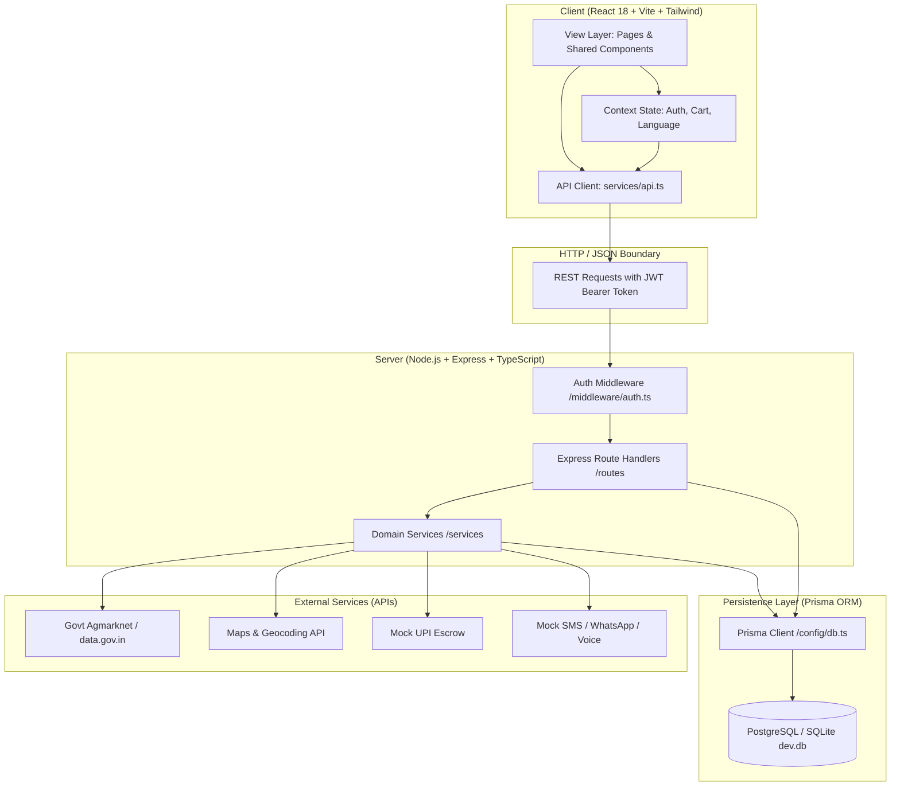
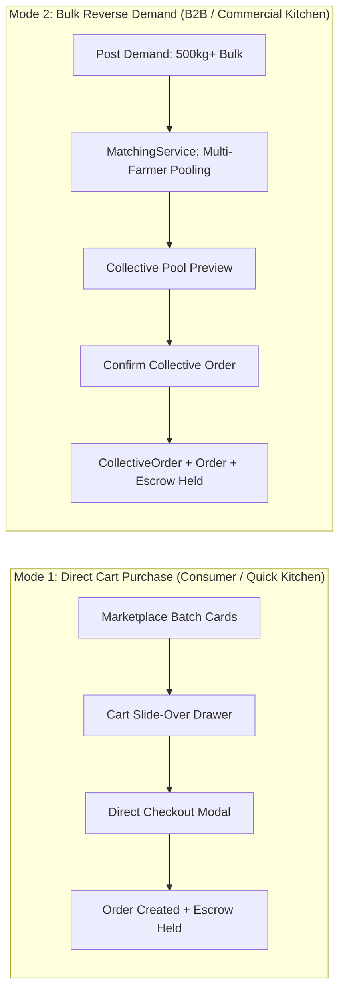

# 🏛️ KisanDirect System Architecture

> **Repository**: `Farmer_selling_app`  
> **Problem Statement ID**: `SIH26033` (Smart India Hackathon 2026)  
> **Target Agricultural Corridor**: Salem District, Tamil Nadu, India  

---

## 1. High-Level Architectural Topology

KisanDirect is structured as a **modular full-stack monorepo** with clear architectural boundaries separating client-side presentation, domain calculation engines, REST routing controllers, and relational database persistence.

---

## 2. Layered Responsibilities & Boundaries

### Layer 1: Client Presentation (`client/src`)
- **Framework**: React 18 with TypeScript running on Vite 6.
- **Styling**: Tailwind CSS with custom glassmorphic panels and semantic color tokens (`emerald` for fresh, `amber` for aging, `orange`/`rose` for urgent/expired).
- **Navigation Model**: State-based view routing (`currentView` in [`client/src/App.tsx`](file:///d:/Projects/Farmer_selling_app/client/src/App.tsx)). Does not use `react-router-dom`; views transition via `onNavigate(viewName, params)` callback prop, enabling instant zero-latency role switching.
- **Localization**: Custom dual-language engine ([`LanguageContext.tsx`](file:///d:/Projects/Farmer_selling_app/client/src/context/LanguageContext.tsx)) supporting English (`en`) and Tamil (`ta`).

### Layer 2: Client State & Context Layer (`client/src/context`)
- **[`AuthContext.tsx`](file:///d:/Projects/Farmer_selling_app/client/src/context/AuthContext.tsx)**: Manages authenticated user session, JWT token persistence in `localStorage`, role privileges, and polling for user notifications. Includes `demoSwitch(role)` for instant evaluation switcher.
- **[`CartContext.tsx`](file:///d:/Projects/Farmer_selling_app/client/src/context/CartContext.tsx)**: Manages direct-purchase shopping cart (Mode 1), synchronizes item quantities with server endpoints, computes subtotal and delivery fees, and controls slide-over drawer visibility.
- **[`LanguageContext.tsx`](file:///d:/Projects/Farmer_selling_app/client/src/context/LanguageContext.tsx)**: Provides global language toggle (`en` / `ta`), translation helper `t(key)`, and language state persistence.

### Layer 3: API Client & Transport Layer (`client/src/services/api.ts`)
- Centralized singleton `api` instance wrapping standard `fetch`.
- Automatically injects `Authorization: Bearer <jwt_token>` header on all requests.
- Maps typed TypeScript promises to Express backend endpoints.
- Normalizes errors and throws clean Error messages with backend error strings.

### Layer 4: Express HTTP Router & Auth Middleware (`server/src/routes`, `server/src/middleware`)
- **Express 4.21** server running on port `5000` (or `PORT` environment variable).
- **[`server/src/middleware/auth.ts`](file:///d:/Projects/Farmer_selling_app/server/src/middleware/auth.ts)**:
  - `authenticateToken`: Validates Bearer token using `ENV.JWT_SECRET` and populates `req.user`.
  - `requireRole(roles)`: Role-based guard allowing authorized personas (e.g. `['FARMER']`, `['BUYER']`) while granting global oversight bypass to `ADMIN`.
- **Controllers**: 14 modular route files organizing endpoints by domain:
  - Auth, Farmer, Buyer, Order, Logistics, Quality, Payment, Rating, Coordinator, Admin, Notification, Demo, Market Prices, Upload.

### Layer 5: Domain Services & Algorithmic Engines (`server/src/services`)
Core business logic is encapsulated in 7 dedicated stateless service classes:
1. **[`CollectiveSellingService.ts`](file:///d:/Projects/Farmer_selling_app/server/src/services/collectiveSellingService.ts)**: Executes atomic transactions creating collective pooled orders, allocating farmer contributions, deducting batch stock, creating authorized escrow payment records, and notifying farmers.
2. **[`FreshnessService.ts`](file:///d:/Projects/Farmer_selling_app/server/src/services/freshnessService.ts)**: Mathematical shelf-life calculator determining countdown timestamps, status transitions (`FRESH` -> `AGING` -> `URGENT` -> `EXPIRED`), and recommended discount percentages.
3. **[`MarketPriceService.ts`](file:///d:/Projects/Farmer_selling_app/server/src/services/marketPriceService.ts)**: APMC Mandi price benchmark engine covering 25+ crops across 13 Tamil Nadu regulated wholesale markets with in-memory caching and optional live Agmarknet API ingestion.
4. **[`MatchingService.ts`](file:///d:/Projects/Farmer_selling_app/server/src/services/matchingService.ts)**: Multi-factor scoring engine (Haversine distance 25%, budget compatibility 20%, quality grade 20%, freshness 15%, farmer rating 10%, quantity match 10%) and collective supply assembly algorithm.
5. **[`OrderStateMachine.ts`](file:///d:/Projects/Farmer_selling_app/server/src/services/orderStateMachine.ts)**: 10-stage sequential order state machine enforcing valid transitions (`ORDERED` -> `COMPLETED`) with automated side-effects (escrow payout release upon `DELIVERED`, stock restoration upon `CANCELLED`).
6. **[`PaymentService.ts`](file:///d:/Projects/Farmer_selling_app/server/src/services/paymentService.ts)**: Escrow payment authorization and farmer payout settlement logic (98% farmer payout, 2% platform fee).
7. **[`NotificationService.ts`](file:///d:/Projects/Farmer_selling_app/server/src/services/notificationService.ts)**: Multi-channel dispatch (In-App notifications and simulated SMS, WhatsApp, and Voice calls).

### Layer 6: Database & Persistence Layer (`server/prisma`)
- **ORM**: Prisma ORM v6.4.
- **Database Engine**: Configured for PostgreSQL (Supabase) via `DATABASE_URL` with turnkey local fallback to SQLite `dev.db`.
- **Schema**: 28 relational models with foreign keys, cascading deletions where appropriate, and indexed status fields.

---

## 3. Role-Based Security & Permission Matrix

The application enforces 5 distinct user roles:

| Role | Permitted Actions | Restricted Actions |
| :--- | :--- | :--- |
| **`FARMER`** | List produce batches, view incoming buyer offers, accept/reject/counter offers, view participating collective pools, track earnings & payouts | Cannot post commercial buyer demands, cannot initiate checkout, cannot modify quality checks |
| **`BUYER`** | Search marketplace produce, add to cart, direct checkout, post commercial bulk demands, view smart matches, confirm collective pooled orders, track 10-stage deliveries, submit ratings, raise disputes | Cannot list produce batches, cannot accept offers on behalf of farmers, cannot modify logistics dispatch |
| **`COORDINATOR`** | Assisted registration of low-literacy farmers, assisted produce batch creation, voice listing, view village farmers and collection hubs | Cannot authorize payouts, cannot resolve disputes |
| **`LOGISTICS`** | View scheduled pickups, schedule vehicle dispatches, update delivery status & simulated GPS coordinates, submit collection center quality inspection reports | Cannot modify agreed produce prices, cannot alter buyer demands |
| **`ADMIN`** | Full platform oversight: view all platform metrics, inspect financials, suspend/activate user accounts, arbitrate and resolve open order disputes | Global bypass on all `requireRole` checks |

---

## 4. Dual Purchase Architecture

KisanDirect uniquely supports two distinct purchase channels designed for different buyer volumes:

1. **Mode 1 (Direct Cart Purchase)**: For quantities between 1 kg and 100 kg. Immediate checkout from existing batches, payment held in escrow, instant stock deduction.
2. **Mode 2 (Reverse Demand & Collective Supply Pooling)**: For commercial orders between 200 kg and 2000 kg. Demand posted by buyer -> system clusters 2 to 6 small farmers -> buyer confirms single consolidated order -> system splits payouts proportionately.
