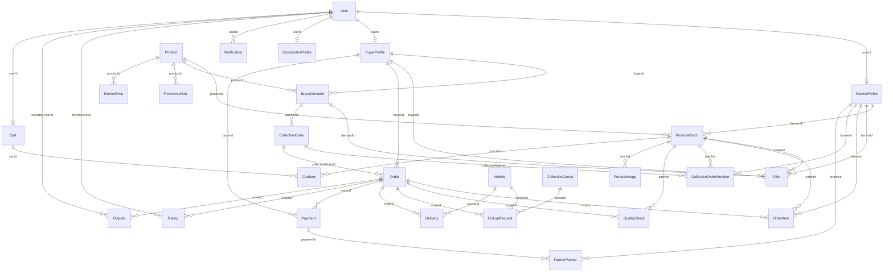

# 🗄️ KisanDirect Database Knowledge & Schema Reference

> **Repository**: `Farmer_selling_app`  
> **Schema File**: [`server/prisma/schema.prisma`](file:///d:/Projects/Farmer_selling_app/server/prisma/schema.prisma) (474 lines)  
> **Seeder Script**: [`server/prisma/seed.ts`](file:///d:/Projects/Farmer_selling_app/server/prisma/seed.ts) (891 lines)  
> **ORM Engine**: Prisma ORM v6.4  
> **Supported Dialects**: PostgreSQL (Production / Supabase) and SQLite (Local Development `dev.db`)

---

## 1. Schema Entity Relationship Diagram

---

## 2. Model Catalog & Schema Specifications

### 2.1 User & Profile Models

#### `User` (Lines 11–31)
- **Table**: `User`
- **Fields**: `id` (String cuid), `email` (String unique), `mobile` (String unique), `name` (String), `passwordHash` (String), `role` (String: FARMER, BUYER, COORDINATOR, LOGISTICS, ADMIN), `status` (String default "ACTIVE": ACTIVE, SUSPENDED, PENDING_VERIFICATION), `preferredLanguage` (String default "en": en, ta), `createdAt` (DateTime), `updatedAt` (DateTime).
- **Relationships**: 1:1 with `FarmerProfile`, `BuyerProfile`, `CoordinatorProfile`, `Cart`; 1:N with `Notification`, `Rating`, `Dispute`.
- **Accessed By**: `authRoutes.ts`, `adminRoutes.ts`, `auth.ts`.
- **Business Rule**: Email and mobile must be globally unique. Mobile is used for instant persona recognition and OTP login.

#### `FarmerProfile` (Lines 33–52)
- **Fields**: `id` (String cuid), `userId` (String unique), `farmerId` (String unique, e.g. `FD-1001`), `village` (String), `district` (String), `state` (String default "Tamil Nadu"), `landSize` (Float, in acres), `rating` (Float default 4.8), `completedOrders` (Int default 0), `verified` (Boolean default true), `joinedDate` (DateTime).
- **Relationships**: Many:1 with `User` (onDelete: Cascade); 1:Many with `ProduceBatch`, `Offer`, `OrderItem`, `CollectiveOrderMember`, `FarmerPayout`.
- **Accessed By**: `farmerRoutes.ts`, `coordinatorRoutes.ts`, `adminRoutes.ts`, `ratingRoutes.ts`, `orderStateMachine.ts`.

#### `BuyerProfile` (Lines 54–73)
- **Fields**: `id` (String cuid), `userId` (String unique), `businessName` (String), `ownerName` (String), `businessType` (String: HOTEL, RESTAURANT, SUPERMARKET, WHOLESALER, CATERING, LOCAL_SHOP), `gstNumber` (String optional), `address` (String), `village` (String optional), `district` (String), `latitude` (Float default 11.6643), `longitude` (Float default 78.1460), `verified` (Boolean default true).
- **Relationships**: Many:1 with `User`; 1:Many with `BuyerDemand`, `Offer`, `Order`, `Payment`.
- **Accessed By**: `buyerRoutes.ts`, `adminRoutes.ts`, `matchingService.ts`.

#### `CoordinatorProfile` (Lines 75–86)
- **Fields**: `id` (String cuid), `userId` (String unique), `village` (String), `district` (String), `assignedCenterId` (String optional), `activeFarmersCount` (Int default 15), `verified` (Boolean default true).
- **Accessed By**: `coordinatorRoutes.ts`, `adminRoutes.ts`.

---

### 2.2 Produce, Freshness & Pricing Models

#### `Product` (Lines 88–104)
- **Fields**: `id` (String cuid), `name` (String unique, e.g. "Tomato"), `nameTamil` (String, e.g. "தக்காளி"), `category` (String: VEGETABLE, FRUIT, GRAIN), `unit` (String default "kg"), `defaultShelfHours` (Int default 24), `referenceMinPrice` (Float), `referenceMaxPrice` (Float), `imageUrl` (String), `createdAt` (DateTime).
- **Relationships**: 1:Many with `ProduceBatch`, `BuyerDemand`, `FreshnessRule`, `MarketPrice`.
- **Accessed By**: `farmerRoutes.ts`, `marketPriceService.ts`, `seed.ts`.

#### `FreshnessRule` (Lines 106–115)
- **Fields**: `id` (String cuid), `productId` (String), `freshDurationHours` (Float), `agingDurationHours` (Float), `urgentDurationHours` (Float), `urgentDiscountPercent` (Float default 15.0).
- **Accessed By**: `freshnessService.ts`, `farmerRoutes.ts`.

#### `MarketPrice` (Lines 117–127)
- **Fields**: `id` (String cuid), `productId` (String), `district` (String), `date` (String YYYY-MM-DD), `minPrice` (Float), `modalPrice` (Float), `maxPrice` (Float).
- **Accessed By**: `marketPriceService.ts`, `farmerRoutes.ts`.

#### `ProduceBatch` (Lines 129–160)
- **Fields**: `id` (String cuid), `batchCode` (String unique, e.g. `TOM-2026-00012`), `farmerId` (String), `productId` (String), `quantity` (Float), `initialQuantity` (Float), `pricePerKg` (Float), `qualityGrade` (String: A, B, C), `harvestedAt` (DateTime), `listedAt` (DateTime), `sellBy` (DateTime), `freshnessStatus` (String: FRESH, AGING, URGENT, EXPIRED), `status` (String: ACTIVE, RESERVED, SOLD_OUT, EXPIRED), `village` (String), `district` (String default "Salem"), `latitude` (Float), `longitude` (Float), `imageUrl` (String optional), `notes` (String optional).
- **Relationships**: Foreign keys to `FarmerProfile`, `Product`; 1:Many with `Offer`, `OrderItem`, `CollectiveOrderMember`, `QualityCheck`, `ProductImage`, `CartItem`.
- **Accessed By**: `farmerRoutes.ts`, `buyerRoutes.ts`, `matchingService.ts`, `freshnessService.ts`, `demoRoutes.ts`.
- **Business Rule**: Decrementing quantity to 0 must transition `status` to `SOLD_OUT`. When `freshnessStatus` becomes `EXPIRED`, status becomes `EXPIRED`.

---

### 2.3 Demands, Offers & Collective Orders

#### `BuyerDemand` (Lines 162–186)
- **Fields**: `id` (String cuid), `demandCode` (String unique, e.g. `DEM-2026-0001`), `buyerId` (String), `productId` (String), `requiredQuantity` (Float), `minBudget` (Float), `maxBudget` (Float), `requiredGrade` (String default "A"), `deliveryDeadline` (DateTime), `location` (String), `district` (String), `latitude` (Float), `longitude` (Float), `maxDistanceKm` (Float default 25.0), `status` (String: OPEN, MATCHED, FULFILLED, CANCELLED), `notes` (String optional).
- **Relationships**: Foreign keys to `BuyerProfile`, `Product`; 1:Many with `Offer`, `CollectiveOrder`.
- **Accessed By**: `buyerRoutes.ts`, `matchingService.ts`.

#### `Offer` (Lines 188–207)
- **Fields**: `id` (String cuid), `demandId` (String), `batchId` (String), `buyerId` (String), `farmerId` (String), `offeredPricePerKg` (Float), `quantity` (Float), `status` (String: PENDING, ACCEPTED, REJECTED, COUNTERED), `isCounterOffer` (Boolean default false), `notes` (String optional).
- **Relationships**: 1:Many with `OfferHistory`.
- **Accessed By**: `farmerRoutes.ts`, `buyerRoutes.ts`.

#### `OfferHistory` (Lines 209–219)
- **Fields**: `id` (String cuid), `offerId` (String), `proposedByUserId` (String), `pricePerKg` (Float), `notes` (String optional), `createdAt` (DateTime).
- **Accessed By**: `farmerRoutes.ts`, `buyerRoutes.ts`.

#### `CollectiveOrder` (Lines 220–233)
- **Fields**: `id` (String cuid), `collectiveCode` (String unique, e.g. `COL-2026-0001`), `demandId` (String), `totalQuantity` (Float), `agreedPricePerKg` (Float), `totalAmount` (Float), `status` (String: PENDING, FORMED, CONFIRMED, COMPLETED).
- **Relationships**: Many:1 with `BuyerDemand`; 1:Many with `CollectiveOrderMember`, `Order`.
- **Accessed By**: `collectiveSellingService.ts`, `farmerRoutes.ts`, `adminRoutes.ts`.

#### `CollectiveOrderMember` (Lines 235–248)
- **Fields**: `id` (String cuid), `collectiveOrderId` (String), `farmerId` (String), `batchId` (String), `allocatedQuantity` (Float), `payoutAmount` (Float), `status` (String default "ACCEPTED": ACCEPTED, DELIVERED, REJECTED).
- **Accessed By**: `collectiveSellingService.ts`, `farmerRoutes.ts`.

---

### 2.4 Order Lifecycle & Fulfillment Models

#### `Order` (Lines 249–275)
- **Fields**: `id` (String cuid), `orderCode` (String unique, e.g. `ORD-1001`), `buyerId` (String), `collectiveOrderId` (String optional), `totalQuantity` (Float), `totalAmount` (Float), `platformFee` (Float default 0, 2%), `farmerPayout` (Float), `status` (String: ORDERED, ACCEPTED, PICKUP_SCHEDULED, COLLECTED, QUALITY_CHECKED, PACKED, DISPATCHED, DELIVERED, PAYMENT_RELEASED, COMPLETED, CANCELLED), `deliveryAddress` (String), `scheduledPickupTime` (DateTime optional), `deliveredAt` (DateTime optional).
- **Relationships**: 1:Many with `OrderItem`, `QualityCheck`, `PickupRequest`, `Delivery`, `Payment`, `Rating`, `Dispute`.
- **Accessed By**: `orderRoutes.ts`, `orderStateMachine.ts`, `buyerRoutes.ts`, `collectiveSellingService.ts`, `adminRoutes.ts`.

#### `OrderItem` (Lines 277–289)
- **Fields**: `id` (String cuid), `orderId` (String), `farmerId` (String), `batchId` (String), `quantity` (Float), `pricePerKg` (Float), `total` (Float).
- **Accessed By**: `orderRoutes.ts`, `farmerRoutes.ts`, `buyerRoutes.ts`, `orderStateMachine.ts`.

#### `QualityCheck` (Lines 305–323)
- **Fields**: `id` (String cuid), `orderId` (String), `batchId` (String), `inspectorId` (String optional), `expectedQty` (Float), `actualQty` (Float), `damagedQty` (Float default 0), `acceptedQty` (Float), `gradeAssigned` (String: A, B, C), `damagePercentage` (Float default 0), `photos` (String optional), `remarks` (String optional), `status` (String default "PASSED": PASSED, PARTIAL, REJECTED), `checkedAt` (DateTime).
- **Accessed By**: `qualityRoutes.ts`, `orderRoutes.ts`, `adminRoutes.ts`.

#### `Vehicle` (Lines 325–336)
- **Fields**: `id` (String cuid), `vehicleNumber` (String unique), `vehicleType` (String default "Small Truck (1.5 Ton)"), `driverName` (String), `driverMobile` (String), `capacityKg` (Float default 1500), `status` (String default "AVAILABLE": AVAILABLE, EN_ROUTE, DELIVERED).
- **Accessed By**: `logisticsRoutes.ts`.

#### `CollectionCenter` (Lines 291–303)
- **Fields**: `id` (String cuid), `centerCode` (String unique), `name` (String), `village` (String), `district` (String), `coordinatorId` (String optional), `latitude` (Float), `longitude` (Float).
- **Accessed By**: `logisticsRoutes.ts`.

#### `PickupRequest` (Lines 338–349)
- **Fields**: `id` (String cuid), `orderId` (String), `centerId` (String), `vehicleId` (String optional), `status` (String default "SCHEDULED": SCHEDULED, IN_PROGRESS, COMPLETED), `scheduledTime` (DateTime).
- **Accessed By**: `logisticsRoutes.ts`.

#### `Delivery` (Lines 351–364)
- **Fields**: `id` (String cuid), `orderId` (String), `vehicleId` (String optional), `currentLat` (Float), `currentLng` (Float), `status` (String default "ASSIGNED": ASSIGNED, PICKED_UP, IN_TRANSIT, DELIVERED), `estimatedArrival` (DateTime optional), `startedAt` (DateTime optional), `completedAt` (DateTime optional).
- **Accessed By**: `logisticsRoutes.ts`, `orderRoutes.ts`.

---

### 2.5 Payments, Ratings, Notifications & Cart

#### `Payment` (Lines 366–382)
- **Fields**: `id` (String cuid), `paymentCode` (String unique), `orderId` (String), `buyerId` (String), `amount` (Float), `platformFee` (Float default 0), `status` (String default "AUTHORIZED": PENDING, AUTHORIZED, RELEASED, REFUNDED), `paymentMethod` (String default "MOCK_UPI"), `transactionRef` (String optional), `releasedAt` (DateTime optional).
- **Relationships**: 1:Many with `FarmerPayout`.
- **Accessed By**: `paymentRoutes.ts`, `paymentService.ts`, `orderStateMachine.ts`, `buyerRoutes.ts`.

#### `FarmerPayout` (Lines 384–396)
- **Fields**: `id` (String cuid), `paymentId` (String), `farmerId` (String), `amount` (Float), `status` (String default "PENDING": PENDING, RELEASED), `utrRef` (String optional), `releasedAt` (DateTime optional).
- **Accessed By**: `paymentService.ts`, `farmerRoutes.ts`, `orderStateMachine.ts`.

#### `Rating` (Lines 398–410)
- **Fields**: `id` (String cuid), `orderId` (String), `fromUserId` (String), `toUserId` (String), `score` (Int: 1–5), `comment` (String optional), `createdAt` (DateTime).
- **Accessed By**: `ratingRoutes.ts`.

#### `Notification` (Lines 412–425)
- **Fields**: `id` (String cuid), `userId` (String), `title` (String), `message` (String), `type` (String), `channel` (String default "IN_APP": IN_APP, SMS_MOCK, WHATSAPP_MOCK, VOICE_MOCK), `isRead` (Boolean default false), `metadataJson` (String optional), `createdAt` (DateTime).
- **Accessed By**: `notificationRoutes.ts`, `notificationService.ts`.

#### `Dispute` (Lines 427–439)
- **Fields**: `id` (String cuid), `orderId` (String), `raisedByUserId` (String), `reason` (String), `evidenceJson` (String optional), `status` (String default "OPEN": OPEN, UNDER_INVESTIGATION, RESOLVED, REJECTED), `resolutionNotes` (String optional).
- **Accessed By**: `orderRoutes.ts`, `adminRoutes.ts`.

#### `Cart` & `CartItem` (Lines 451–474)
- **`Cart`**: `id` (String cuid), `userId` (String unique).
- **`CartItem`**: `id` (String cuid), `cartId` (String), `batchId` (String), `quantity` (Float).
- **Unique Constraint**: `@@unique([cartId, batchId])`.
- **Accessed By**: `buyerRoutes.ts`.
