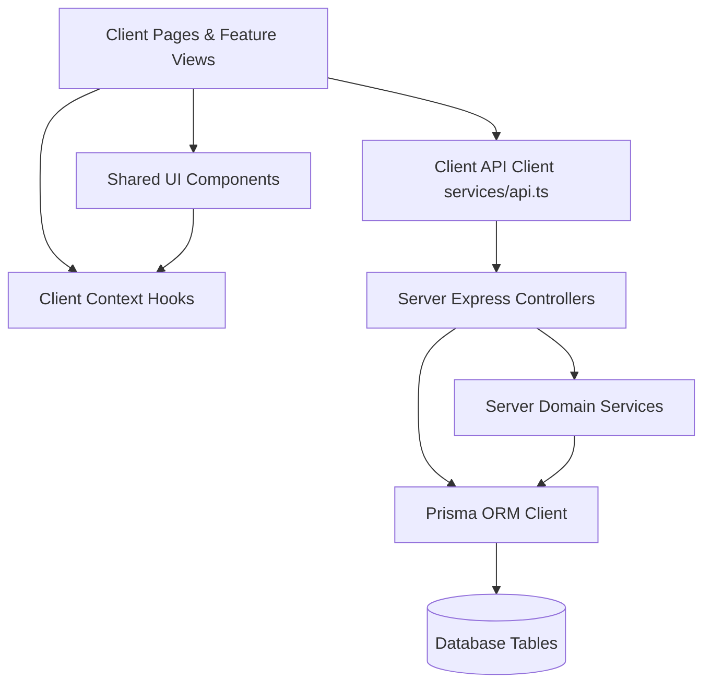

# 🕸️ KisanDirect Dependency & Impact Matrix

> **Repository**: `Farmer_selling_app`  
> Maps directional dependencies, caller-callee hierarchies, database read/write matrices, and transitive impact chains.

---

## 1. System Dependency Hierarchy



---

## 2. Component → Hook & Component Dependencies

| Consumer Component | Depends On / Uses | Relationship |
| :--- | :--- | :--- |
| `component:App` | `hook:useAuth`, `hook:useLanguage`, `hook:useCart` | `uses_hook` |
| `component:App` | `component:Navbar`, `component:DemoScenarioBar`, `component:CartDrawer`, `component:CheckoutModal`, `component:VoiceListingModal` | `renders` |
| `component:Navbar` | `hook:useAuth`, `hook:useLanguage`, `hook:useCart` | `uses_hook` |
| `component:Marketplace` | `hook:useLanguage`, `hook:useCart`, `component:FreshnessBadge` | `uses_hook`, `renders` |
| `component:SmartMatches` | `hook:useLanguage`, `feature:collective-selling`, `feature:smart-matching-algorithm` | `uses_hook`, `implements` |
| `component:CartDrawer` | `hook:useCart`, `hook:useLanguage` | `uses_hook` |
| `component:CheckoutModal` | `hook:useCart`, `hook:useAuth`, `hook:useLanguage` | `uses_hook` |
| `component:BuyerOrders` | `hook:useLanguage`, `component:DeliveryMap`, `feature:escrow-order-state-machine` | `uses_hook`, `renders`, `implements` |
| `component:AddProduce` | `hook:useLanguage`, `component:FairPriceGauge`, `feature:fair-price-transparency` | `uses_hook`, `renders`, `implements` |
| `component:VoiceListingModal` | `hook:useLanguage`, `feature:voice-assisted-listing` | `uses_hook`, `implements` |
| `component:LogisticsDashboard` | `hook:useLanguage`, `hook:useAuth`, `component:DeliveryMap` | `uses_hook`, `renders` |

---

## 3. Route Controller → Service & Database Access Matrix

| Route Controller | Domain Services Invoked | Database Tables Mutated | Database Tables Queried |
| :--- | :--- | :--- | :--- |
| `server/src/routes/authRoutes.ts` | None | `User`, `FarmerProfile`, `BuyerProfile`, `CoordinatorProfile` | `User` |
| `server/src/routes/farmerRoutes.ts` | `FreshnessService` | `ProduceBatch`, `ProductImage`, `Offer`, `OfferHistory`, `Notification` | `Product`, `ProduceBatch`, `Offer`, `OrderItem`, `FarmerPayout` |
| `server/src/routes/buyerRoutes.ts` | `MatchingService`, `CollectiveSellingService`, `FreshnessService` | `BuyerDemand`, `CollectiveOrder`, `CollectiveOrderMember`, `Order`, `OrderItem`, `ProduceBatch`, `Payment`, `Delivery`, `CartItem`, `Notification` | `ProduceBatch`, `BuyerDemand`, `Order`, `Cart`, `CartItem` |
| `server/src/routes/orderRoutes.ts` | `OrderStateMachine` | `Order`, `Dispute`, `Notification` | `Order` |
| `server/src/routes/logisticsRoutes.ts` | `OrderStateMachine` | `PickupRequest`, `Delivery`, `Order` | `PickupRequest`, `Delivery`, `Vehicle`, `CollectionCenter` |
| `server/src/routes/qualityRoutes.ts` | `OrderStateMachine` | `QualityCheck`, `Order` | `QualityCheck` |
| `server/src/routes/paymentRoutes.ts` | `PaymentService` | `Payment`, `FarmerPayout` | `Payment`, `Order` |
| `server/src/routes/ratingRoutes.ts` | None | `Rating`, `FarmerProfile` | `Rating`, `FarmerProfile` |
| `server/src/routes/coordinatorRoutes.ts` | `FreshnessService` | `User`, `FarmerProfile`, `ProduceBatch` | `FarmerProfile`, `Product` |
| `server/src/routes/adminRoutes.ts` | None | `Dispute`, `User` | `FarmerProfile`, `BuyerProfile`, `ProduceBatch`, `Order`, `Dispute` |
| `server/src/routes/demoRoutes.ts` | `NotificationService` | `ProduceBatch`, `Notification` | `ProduceBatch` |
| `server/src/routes/marketPriceRoutes.ts` | `MarketPriceService` | None | In-memory cache & Agmarknet API |

---

## 4. Function Call Trees (`callees` & `callers`)

### Tree 1: Collective Supply Order Creation
```
POST /api/buyers/demands/:id/collective-order (buyerRoutes.ts)
    └── CollectiveSellingService.createCollectiveOrder
            ├── prisma.$transaction
            │     ├── tx.collectiveOrder.create
            │     ├── tx.order.create
            │     ├── tx.produceBatch.findUnique
            │     ├── tx.collectiveOrderMember.create
            │     ├── tx.orderItem.create
            │     ├── tx.produceBatch.update (quantity decrement, SOLD_OUT/RESERVED)
            │     ├── tx.notification.create
            │     ├── tx.buyerDemand.update (status: MATCHED)
            │     └── tx.payment.create (status: AUTHORIZED)
            └── returns { order, collectiveOrder, payment }
```

### Tree 2: Smart Matching Execution
```
GET /api/buyers/demands/:id/matches (buyerRoutes.ts)
    └── MatchingService.findMatchesForDemand(demandId)
            ├── prisma.buyerDemand.findUnique
            ├── prisma.produceBatch.findMany (active batches of same product)
            ├── for each batch:
            │     ├── MatchingService.calculateDistance(lat1, lon1, lat2, lon2)
            │     └── MatchingService.evaluateBatchSuitability(batch, demand, dist)
            └── MatchingService.buildCollectiveSupplyPool(candidates, reqQty)
                    └── aggregates batches until accumulatedQty >= requiredQuantity
```

### Tree 3: Order State Transition Execution
```
PATCH /api/orders/:id/status (orderRoutes.ts)
    └── OrderStateMachine.transitionOrder(orderId, nextStatus, actorId)
            ├── OrderStateMachine.isValidTransition(currentStatus, nextStatus)
            ├── prisma.$transaction
            │     ├── tx.order.update(status: nextStatus)
            │     ├── IF nextStatus === 'DELIVERED':
            │     │     ├── tx.payment.update(status: RELEASED)
            │     │     ├── tx.farmerPayout.create (for each farmer item, 98% net)
            │     │     └── tx.farmerProfile.update (increment completedOrders)
            │     ├── IF nextStatus === 'CANCELLED':
            │     │     └── tx.produceBatch.update (increment quantity, status: ACTIVE)
            │     └── tx.notification.create (notify buyer and all participating farmers)
            └── returns updatedOrder
```

---

## 5. Transitive Impact Analysis Chains

When modifying an entity, the following ripple effects occur:

### If Modifying: `table:ProduceBatch`
- **Impacted Services**:
  - `CollectiveSellingService`: Quantity deduction, status transition to `SOLD_OUT`.
  - `FreshnessService`: Status recalculation, expiry marking.
  - `MatchingService`: Available pool calculations.
  - `OrderStateMachine`: Quantity rollback on cancellation.
- **Impacted API Endpoints**:
  - `POST /api/farmers/batches`, `GET /api/farmers/batches`
  - `GET /api/buyers/marketplace`, `POST /api/buyers/checkout`
  - `GET /api/buyers/demands/:id/matches`, `POST /api/buyers/demands/:id/collective-order`
  - `POST /api/demo/simulate-urgency`, `POST /api/demo/simulate-expiry`
- **Impacted UI Components**:
  - `FreshnessBadge`, `Marketplace`, `AddProduce`, `MyProduce`, `ProductDetailPage`, `CartDrawer`, `SmartMatches`

### If Modifying: `table:Order`
- **Impacted Services**: `OrderStateMachine`, `CollectiveSellingService`, `PaymentService`.
- **Impacted API Endpoints**:
  - `GET /api/orders/:id`, `PATCH /api/orders/:id/status`, `POST /api/orders/:id/dispute`
  - `POST /api/buyers/checkout`, `POST /api/buyers/demands/:id/collective-order`
  - `GET /api/logistics/pickups`, `POST /api/logistics/pickups`
  - `GET /api/logistics/deliveries`, `PATCH /api/logistics/deliveries/:id/status`
  - `POST /api/quality-checks`
- **Impacted UI Components**: `BuyerOrders`, `FarmerOrders`, `LogisticsDashboard`, `AdminDashboard`.

### If Modifying: `hook:useAuth`
- **Impacted UI Components**: `App`, `Navbar`, `CheckoutModal`, `ProfilePage`, `LoginPage`, `RegisterPage`, `DemoScenarioBar`.
