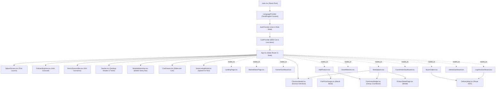

# 🖥️ KisanDirect UI Knowledge Graph & Frontend Architecture

> **Repository**: `Farmer_selling_app` (Frontend Application: [`client/`](file:///d:/Projects/Farmer_selling_app/client))  
> **Framework**: React 18 (TypeScript) + Vite + Tailwind CSS + Lucide Icons  
> **Primary Graph Files**: 
> - [`.knowledge/ui-knowledge-graph.json`](file:///d:/Projects/Farmer_selling_app/.knowledge/ui-knowledge-graph.json) (Dedicated UI Graph: 67 nodes, 172 edges)
> - [`.knowledge/knowledge-graph.json`](file:///d:/Projects/Farmer_selling_app/.knowledge/knowledge-graph.json) (Master Full-Stack Graph: 249 nodes, 395 edges)

---

## 📑 Table of Contents
1. [Architectural Overview & State-Based Router](#1-architectural-overview--state-based-router)
2. [Role-Based View Matrix (24 Views)](#2-role-based-view-matrix-24-views)
3. [Component Hierarchy & Rendering Tree](#3-component-hierarchy--rendering-tree)
4. [Overlay & Modal System (6 Overlays)](#4-overlay--modal-system-6-overlays)
5. [Complete Component Manifest (Props, State, Events, Hooks, APIs)](#5-complete-component-manifest)
6. [Design System, Color Tokens & Freshness Coding](#6-design-system-color-tokens--freshness-coding)
7. [Bilingual Localization Engine (Tamil & English)](#7-bilingual-localization-engine-tamil--english)
8. [Context & State Management Architecture](#8-context--state-management-architecture)
9. [UI Graph Querying Guide](#9-ui-graph-querying-guide)

---

## 1. Architectural Overview & State-Based Router

KisanDirect’s frontend is a single-page application built deliberately **without `react-router-dom`**. It utilizes a centralized, highly deterministic **State-Based View Router** managed directly at [`client/src/App.tsx`](file:///d:/Projects/Farmer_selling_app/client/src/App.tsx).

### Routing Mechanics
- **State Control**: Navigation state is held in `currentView: string` (default: `'landing'`) and `viewParams: any` (optional payload for detail views, e.g. active tab, filter, or selected item).
- **Navigation Dispatcher**: Provided to all view components via the prop callback:
  ```typescript
  onNavigate: (view: string, params?: any) => void
  ```
- **Persona Context Switching**: The header navigation (`Navbar.tsx`) and bottom navigation (`MobileBottomNav.tsx`) dynamically switch navigation links based on the authenticated user's role (`FARMER`, `BUYER`, `COORDINATOR`, `LOGISTICS`, `ADMIN`), with immediate preview switching enabled via `DemoScenarioBar.tsx`.

### Benefits for AI Agents
1. Zero route-matching ambiguity: every screen has a unique slug and corresponding component.
2. Direct component isolation: components do not rely on URL query parsing or hook useParams wrappers.
3. Param passing is explicit via `viewParams`.

---

## 2. Role-Based View Matrix (24 Views)

The application comprises **24 distinct views** categorized across 6 user personas and public access.

| Role | Slug | View Name | Component | Source File | Description |
| :--- | :--- | :--- | :--- | :--- | :--- |
| **PUBLIC** | `landing` | Landing Page | [`LandingPage`](file:///d:/Projects/Farmer_selling_app/client/src/features/public/LandingPage.tsx) | `features/public/LandingPage.tsx` | Hero, innovations, APMC rates preview, role cards |
| **PUBLIC** | `how-it-works` | How It Works | [`HowItWorksPage`](file:///d:/Projects/Farmer_selling_app/client/src/features/public/HowItWorksPage.tsx) | `features/public/HowItWorksPage.tsx` | 4-step direct agricultural supply chain explanation |
| **PUBLIC** | `market-rates` | Live Market Rates | [`MarketRatesPage`](file:///d:/Projects/Farmer_selling_app/client/src/features/public/MarketRatesPage.tsx) | `features/public/MarketRatesPage.tsx` | 13-mandi APMC daily rates explorer with category filters |
| **PUBLIC** | `for-farmers` | For Farmers | [`ForFarmersPage`](file:///d:/Projects/Farmer_selling_app/client/src/features/public/ForFarmersPage.tsx) | `features/public/ForFarmersPage.tsx` | Value proposition & fair price guarantee for farmers |
| **PUBLIC** | `for-buyers` | For Buyers | [`ForBuyersPage`](file:///d:/Projects/Farmer_selling_app/client/src/features/public/ForBuyersPage.tsx) | `features/public/ForBuyersPage.tsx` | Bulk collective supply & freshness guarantee for B2B buyers |
| **PUBLIC** | `impact` | Impact Telemetry | [`ImpactPage`](file:///d:/Projects/Farmer_selling_app/client/src/features/public/ImpactPage.tsx) | `features/public/ImpactPage.tsx` | Middlemen margin savings and food waste reduction stats |
| **PUBLIC** | `login` | Login | [`LoginPage`](file:///d:/Projects/Farmer_selling_app/client/src/features/auth/LoginPage.tsx) | `features/auth/LoginPage.tsx` | Login form with password/mobile and persona switcher pills |
| **PUBLIC** | `register` | Registration | [`RegisterPage`](file:///d:/Projects/Farmer_selling_app/client/src/features/auth/RegisterPage.tsx) | `features/auth/RegisterPage.tsx` | Multi-step role-based registration wizard |
| **AUTH** | `profile` | User Profile | [`ProfilePage`](file:///d:/Projects/Farmer_selling_app/client/src/features/auth/ProfilePage.tsx) | `features/auth/ProfilePage.tsx` | Profile credentials, verified badges, and contact details |
| **FARMER** | `farmer-dashboard` | Farmer Dashboard | [`FarmerDashboard`](file:///d:/Projects/Farmer_selling_app/client/src/features/farmer/FarmerDashboard.tsx) | `features/farmer/FarmerDashboard.tsx` | Hub overview: quick actions, pending offers, earnings summary |
| **FARMER** | `farmer-produce` | My Produce | [`MyProduce`](file:///d:/Projects/Farmer_selling_app/client/src/features/farmer/MyProduce.tsx) | `features/farmer/MyProduce.tsx` | Produce batch inventory with freshness countdown cards |
| **FARMER** | `farmer-add-produce` | Add Produce Wizard | [`AddProduce`](file:///d:/Projects/Farmer_selling_app/client/src/features/farmer/AddProduce.tsx) | `features/farmer/AddProduce.tsx` | 5-step listing wizard: photo, grade, price gauge, freshness preview |
| **FARMER** | `farmer-offers` | Farmer Offers Inbox | [`FarmerOffers`](file:///d:/Projects/Farmer_selling_app/client/src/features/farmer/FarmerOffers.tsx) | `features/farmer/FarmerOffers.tsx` | Incoming buyer offers with Accept, Reject, Counter-Offer |
| **FARMER** | `farmer-collective` | Collective Pools | [`FarmerCollective`](file:///d:/Projects/Farmer_selling_app/client/src/features/farmer/FarmerCollective.tsx) | `features/farmer/FarmerCollective.tsx` | History of pooled collective orders farmer contributes to |
| **FARMER** | `farmer-orders` | Farmer Orders | [`FarmerOrders`](file:///d:/Projects/Farmer_selling_app/client/src/features/farmer/FarmerOrders.tsx) | `features/farmer/FarmerOrders.tsx` | Fulfillment status & collection depot drop-off tracking |
| **FARMER** | `farmer-earnings` | Farmer Earnings | [`FarmerEarnings`](file:///d:/Projects/Farmer_selling_app/client/src/features/farmer/FarmerEarnings.tsx) | `features/farmer/FarmerEarnings.tsx` | Payout history, monthly volume chart, middlemen savings |
| **BUYER** | `buyer-dashboard` | Buyer Dashboard | [`BuyerDashboard`](file:///d:/Projects/Farmer_selling_app/client/src/features/buyer/BuyerDashboard.tsx) | `features/buyer/BuyerDashboard.tsx` | Active demands, orders in transit, total spend metrics |
| **BUYER** | `buyer-marketplace` | Marketplace Catalog | [`Marketplace`](file:///d:/Projects/Farmer_selling_app/client/src/features/buyer/Marketplace.tsx) | `features/buyer/Marketplace.tsx` | Live produce catalog with filters, sorting, and direct cart actions |
| **BUYER** | `buyer-post-demand` | Post Bulk Demand | [`PostDemand`](file:///d:/Projects/Farmer_selling_app/client/src/features/buyer/PostDemand.tsx) | `features/buyer/PostDemand.tsx` | Form for commercial buyers to post bulk requirements (500-2000kg) |
| **BUYER** | `buyer-smart-matches` | Smart Matches | [`SmartMatches`](file:///d:/Projects/Farmer_selling_app/client/src/features/buyer/SmartMatches.tsx) | `features/buyer/SmartMatches.tsx` | Multi-factor suitability matches & collective supply pooling |
| **BUYER** | `buyer-orders` | Buyer Orders | [`BuyerOrders`](file:///d:/Projects/Farmer_selling_app/client/src/features/buyer/BuyerOrders.tsx) | `features/buyer/BuyerOrders.tsx` | 10-stage order tracking with interactive route map & reviews |
| **COORDINATOR** | `coordinator-dashboard` | Coordinator Hub | [`CoordinatorDashboard`](file:///d:/Projects/Farmer_selling_app/client/src/features/coordinator/CoordinatorDashboard.tsx) | `features/coordinator/CoordinatorDashboard.tsx` | Village Digital Hub desk for assisted onboarding & voice listing |
| **LOGISTICS** | `logistics-dashboard` | Logistics Fleet | [`LogisticsDashboard`](file:///d:/Projects/Farmer_selling_app/client/src/features/logistics/LogisticsDashboard.tsx) | `features/logistics/LogisticsDashboard.tsx` | Fleet management: pickup scheduling, GPS updates, QC checks |
| **ADMIN** | `admin-dashboard` | Admin Governance | [`AdminDashboard`](file:///d:/Projects/Farmer_selling_app/client/src/features/admin/AdminDashboard.tsx) | `features/admin/AdminDashboard.tsx` | Platform metrics, dispute arbitration, user & batch moderation |

---

## 3. Component Hierarchy & Rendering Tree

The following diagram illustrates the component mounting hierarchy from the application root down to reusable leaf components and modal overlays:



---

## 4. Overlay & Modal System (6 Overlays)

Modals and slide-over drawers are hoisted to appropriate level boundaries to guarantee un-clipped stacking context and full-viewport access:

| Overlay Entity | Component | Mount Point | Open Condition | Purpose & Interactions |
| :--- | :--- | :--- | :--- | :--- |
| `overlay:CartDrawer` | [`CartDrawer.tsx`](file:///d:/Projects/Farmer_selling_app/client/src/features/buyer/CartDrawer.tsx) | `App.tsx` | `isCartOpen === true` (from `CartContext`) | Slide-over drawer with item listing, batch quantities, subtotal calculation, delivery fee estimate, and "Proceed to Checkout" action. |
| `overlay:CheckoutModal` | [`CheckoutModal.tsx`](file:///d:/Projects/Farmer_selling_app/client/src/features/buyer/CheckoutModal.tsx) | `App.tsx` & `Marketplace.tsx` | `isGlobalCheckoutOpen` or `isCheckoutModalOpen` | Direct checkout dialog to confirm delivery address, phone, item summary, and trigger `POST /api/buyers/checkout` with escrow authorization. |
| `overlay:ProductDetailPage` | [`ProductDetailPage.tsx`](file:///d:/Projects/Farmer_selling_app/client/src/features/buyer/ProductDetailPage.tsx) | `Marketplace.tsx` | `activeDetailBatch !== null` | Full modal view of a produce batch showing photo gallery, farmer rating, harvest age countdown, quality grade, and direct quantity selector. |
| `overlay:VoiceListingModal` | [`VoiceListingModal.tsx`](file:///d:/Projects/Farmer_selling_app/client/src/components/common/VoiceListingModal.tsx) | `App.tsx` | `voiceModalOpen === true` | Speech-to-text dialog supporting Tamil (`ta-IN`) and English (`en-IN`) simulation. Parses spoken text into crop, quantity, and expected price. |
| `overlay:OnboardingView` | [`OnboardingView.tsx`](file:///d:/Projects/Farmer_selling_app/client/src/components/common/OnboardingView.tsx) | `App.tsx` | `hasOnboarded === false && !showSplash` | 4-step interactive carousel introducing the direct selling model and prompting the user to select their role. |
| `overlay:SplashScreen` | [`SplashScreen.tsx`](file:///d:/Projects/Farmer_selling_app/client/src/components/common/SplashScreen.tsx) | `App.tsx` | `showSplash === true` (on initial load) | Animated splash banner showing KisanDirect logo, Problem Statement `SIH26033` tag, and agricultural corridor branding. |

---

## 5. Complete Component Manifest

The UI layer comprises **37 React components** indexed in `ui-knowledge-graph.json`. Below is the detailed specification for key components:

### 1. [`Marketplace.tsx`](file:///d:/Projects/Farmer_selling_app/client/src/features/buyer/Marketplace.tsx)
- **Props**: `onNavigate: (view: string, params?: any) => void`
- **State**:
  - `batches: ProduceBatch[]` - Live batches fetched from backend
  - `products: Product[]` - Reference crops catalog
  - `loading: boolean` - Fetching state indicator
  - `searchQuery: string` - Text filter
  - `selectedCategory: string`, `selectedGrade: string`, `selectedFreshness: string`, `maxPrice: string`, `sortBy: string` - Filter drawer criteria
  - `isFilterDrawerOpen: boolean` - Mobile filter drawer toggle
  - `activeDetailBatch: ProduceBatch | null` - Product modal target
  - `directCheckoutItem: DirectCheckoutItem | null` - Immediate purchase target
  - `selectedBatchForOffer: ProduceBatch | null` - Price negotiation target
  - `offerPrice: string`, `offerQuantity: string`, `offerNotes: string`, `submittingOffer: boolean` - Offer modal form state
- **Events**: `handleAddToCart`, `handleBuyNow`, `handleOpenOfferModal`, `handleSendOffer`, `onNavigate`
- **Hooks**: `useLanguage`, `useCart`
- **APIs Called**: `api.getMarketplaceProduce`, `api.getFarmerProducts`, `api.sendBuyerOffer`
- **Children**: `FreshnessBadge`, `ProductDetailPage`, `CheckoutModal`

### 2. [`AddProduce.tsx`](file:///d:/Projects/Farmer_selling_app/client/src/features/farmer/AddProduce.tsx)
- **Props**: `onNavigate: (view: string) => void`
- **State**:
  - `step: number` (1: Crop Select, 2: Quantity & Grade, 3: Pricing, 4: Harvest & Photo, 5: Review & Publish)
  - `selectedProduct: Product | null`
  - `quantity: string`, `qualityGrade: "A" | "B" | "C"`, `expectedPrice: string`
  - `harvestTime: string`, `sellByHours: number`
  - `uploadedImageUrl: string | null`, `imagePreview: string | null`, `isUploadingImage: boolean`
  - `createdBatch: any`
- **Events**: `handleProductSelect`, `handleFileChange`, `handlePublish`, `onNavigate`
- **Hooks**: `useLanguage`
- **APIs Called**: `api.getFarmerProducts`, `api.uploadImage`, `api.createFarmerBatch`
- **Children**: `FairPriceGauge`, `FreshnessBadge`

### 3. [`SmartMatches.tsx`](file:///d:/Projects/Farmer_selling_app/client/src/features/buyer/SmartMatches.tsx)
- **Props**: `demandId?: string`, `onNavigate: (view: string) => void`
- **State**:
  - `demands: BuyerDemand[]`, `selectedDemand: BuyerDemand | null`
  - `matches: any[]`, `poolingOpportunity: any | null`
  - `loading: boolean`, `creatingOrder: boolean`, `orderSuccess: boolean`
- **Events**: `handleSelectDemand`, `handleCreateCollectiveOrder`, `onNavigate`
- **Hooks**: `useLanguage`
- **APIs Called**: `api.getBuyerDemands`, `api.getSmartMatches`, `api.createCollectiveOrder`
- **Children**: `FreshnessBadge`

### 4. [`FreshnessBadge.tsx`](file:///d:/Projects/Farmer_selling_app/client/src/components/common/FreshnessBadge.tsx)
- **Props**:
  - `status: "FRESH" | "AGING" | "URGENT" | "EXPIRED"`
  - `remainingText?: string`, `hoursRemaining?: number`, `minutesRemaining?: number`
  - `showIcon?: boolean`, `size?: "sm" | "md" | "lg"`
- **Hooks**: `useLanguage`
- **Visuals**: Dynamic Tailwind styling with pulse animations on `URGENT` status.

### 5. [`FairPriceGauge.tsx`](file:///d:/Projects/Farmer_selling_app/client/src/components/common/FairPriceGauge.tsx)
- **Props**:
  - `modalPrice: number` (Salem APMC benchmark)
  - `currentPrice: number` (Farmer's asking price)
  - `minPrice?: number`, `maxPrice?: number`, `compact?: boolean`
- **Hooks**: `useLanguage`
- **Visuals**: Horizontal gauge with green/yellow/red gradient indicator comparing farmer price to mandi modal rates.

### 6. [`DeliveryMap.tsx`](file:///d:/Projects/Farmer_selling_app/client/src/components/common/DeliveryMap.tsx)
- **Props**:
  - `orderStatus: OrderStatus`
  - `deliveryAddress?: string`, `compact?: boolean`
- **Hooks**: `useLanguage`
- **Visuals**: Scalable Vector Graphic (SVG) displaying 4 milestone hubs (Farmer Farm -> Village Aggregation Hub -> Quality Transit Hub -> Buyer Depot) with active animated pulsing pulses matching the 10-stage order state machine.

---

## 6. Design System, Color Tokens & Freshness Coding

KisanDirect implements a modern, accessible UI built with Tailwind CSS.

### 1. Primary Palette (Agricultural Harmony)
- **Primary Green (Emerald)**:
  - Backgrounds: `bg-emerald-600`, `bg-emerald-700`, `hover:bg-emerald-800`
  - Accents: `text-emerald-600`, `border-emerald-500`
  - Glass / Translucency: `bg-emerald-50/80 backdrop-blur-md`
- **Secondary Slate / Dark Mode Neutral**:
  - Neutral text: `text-slate-900` (headings), `text-slate-600` (body)
  - Neutral backgrounds: `bg-slate-50` (page canvas), `bg-white` (cards)
  - Borders: `border-slate-200`

### 2. Freshness Decay Visual Tokens
The freshness decay engine dictates produce visibility and pricing discounts across the UI:

| Status Stage | Time Remaining | Badge Styling | Discount Displayed |
| :--- | :--- | :--- | :--- |
| **`FRESH`** | > 24 hours | `bg-emerald-100 text-emerald-800 border-emerald-300` | Standard price |
| **`AGING`** | 4 to 24 hours | `bg-amber-100 text-amber-800 border-amber-300` | Standard price |
| **`URGENT`** | < 4 hours | `bg-rose-100 text-rose-800 border-rose-400 animate-pulse` | **15% Automatic Decay Discount** |
| **`EXPIRED`** | 0 hours | `bg-slate-200 text-slate-500 border-slate-300 line-through` | De-listed from Marketplace |

### 3. Responsive Breakpoints
- **Mobile (< 768px)**: Fixed bottom navigation bar (`MobileBottomNav`), single-column card feeds, touch-friendly filter drawers.
- **Tablet / Desktop (>= 768px)**: Sticky top header with live market ticker, multi-column grid (`grid-cols-2` / `grid-cols-3` / `grid-cols-4`), slide-over drawers.

---

## 7. Bilingual Localization Engine (Tamil & English)

Located at [`client/src/context/LanguageContext.tsx`](file:///d:/Projects/Farmer_selling_app/client/src/context/LanguageContext.tsx), the localization system is lightweight and has zero external bundle dependencies.

### Key Characteristics
1. **Languages**:
   - `en`: English
   - `ta`: Tamil (தமிழ்)
2. **Persistence**: Active language stored in `localStorage.getItem('kisan_lang')`.
3. **Usage in Components**:
   ```typescript
   const { t, language, setLanguage } = useLanguage();
   // e.g. t('app.name') -> "KisanDirect" (en) or "கிசான்டைரக்ட்" (ta)
   ```
4. **Voice Listing Integration**:
   The `VoiceListingModal` component detects spoken Tamil phrases (e.g., `"இருநூறு கிலோ தக்காளி"` -> 200kg Tomato) and automatically maps them to catalog product IDs and integer quantities.

---

## 8. Context & State Management Architecture

Three React Context providers envelop the application tree in [`client/src/main.tsx`](file:///d:/Projects/Farmer_selling_app/client/src/main.tsx):

```
LanguageProvider (LanguageContext)
 └── AuthProvider (AuthContext)
      └── CartProvider (CartContext)
           └── App
```

### Context Breakdown

#### 1. [`LanguageContext`](file:///d:/Projects/Farmer_selling_app/client/src/context/LanguageContext.tsx)
- **Exposes**: `language: 'en' | 'ta'`, `setLanguage: (lang) => void`, `t: (key) => string`
- **Scope**: Whole-app bilingual string resolution.

#### 2. [`AuthContext`](file:///d:/Projects/Farmer_selling_app/client/src/context/AuthContext.tsx)
- **Exposes**: `user: User | null`, `token: string | null`, `role: Role | null`, `login()`, `register()`, `logout()`, `demoSwitch(role, name)`
- **Scope**: Session persistence (`localStorage.getItem('token')`), role guard validation, demo persona switching.

#### 3. [`CartContext`](file:///d:/Projects/Farmer_selling_app/client/src/context/CartContext.tsx)
- **Exposes**: `cartItems: CartItem[]`, `addToCart()`, `removeFromCart()`, `updateQuantity()`, `clearCart()`, `isCartOpen: boolean`, `openCart()`, `closeCart()`
- **Scope**: Buyer cart state, item totals, slide-over drawer toggle.

---

## 9. UI Graph Querying Guide

AI agents can query the UI Knowledge Graph directly using `.knowledge/scripts/query.js`:

### 1. Inspect any UI Component, View, or Modal
```bash
# Inspect the Marketplace component (props, state, events, hooks, APIs called, children)
node .knowledge/scripts/query.js --ui "Marketplace"

# Inspect the Cart slide-over drawer
node .knowledge/scripts/query.js --ui "CartDrawer"

# Inspect the Voice Listing Modal
node .knowledge/scripts/query.js --ui "VoiceListingModal"
```

### 2. List All Views Grouped by Role
```bash
node .knowledge/scripts/query.js --views
```

### 3. List All Modals and Drawers
```bash
node .knowledge/scripts/query.js --overlays
```

### 4. Check UI Graph Statistics
```bash
node .knowledge/scripts/query.js --stats
```
