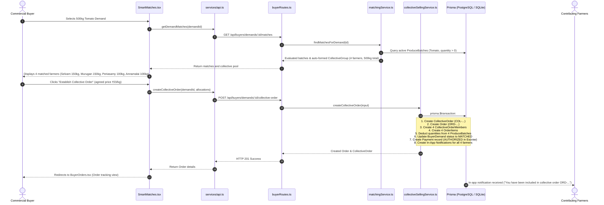

# 🔄 KisanDirect End-to-End Workflows

> **Repository**: `Farmer_selling_app`  
> Complete step-by-step traces of the 7 core end-to-end operational workflows.

---

## Workflow 1: Reverse Demand & Collective Supply Pooling (கூட்டு விற்பனை)

### Business Context
A 4-star hotel in Salem (e.g. ABC Grand Heritage Hotel) needs 500 kg of fresh Grade A tomatoes. No single small farmer has 500 kg ready this morning.

---

## Workflow 2: Direct Marketplace Cart & Single-Click Checkout (Mode 1)

### Business Context
A local restaurant chef browses current morning listings, selects 15 kg brinjal and 10 kg tomatoes, and checks out immediately.

### Step-by-Step Trace
1. **User Action**: Buyer clicks "Add to Cart" on produce batch card in [`Marketplace.tsx`](file:///d:/Projects/Farmer_selling_app/client/src/features/buyer/Marketplace.tsx).
2. **UI Component**: [`Marketplace.tsx`](file:///d:/Projects/Farmer_selling_app/client/src/features/buyer/Marketplace.tsx) calls `addToCart(batchId, quantity)` from `CartContext`.
3. **Handler & Client State**: `addToCart` in [`CartContext.tsx`](file:///d:/Projects/Farmer_selling_app/client/src/context/CartContext.tsx) sends request to backend and refreshes cart state.
4. **Client API Call**: `api.addToCart(batchId, quantity)` calls `POST /api/buyers/cart/items`.
5. **Backend Controller**: [`buyerRoutes.ts:L442-L514`](file:///d:/Projects/Farmer_selling_app/server/src/routes/buyerRoutes.ts#L442-L514) validates that batch exists, is `ACTIVE`, and has sufficient quantity.
6. **Database Mutation**: Upserts `CartItem` linked to buyer's `Cart`.
7. **Slide-Over Drawer**: Buyer clicks Cart icon in [`Navbar.tsx`](file:///d:/Projects/Farmer_selling_app/client/src/components/common/Navbar.tsx), opening [`CartDrawer.tsx`](file:///d:/Projects/Farmer_selling_app/client/src/features/buyer/CartDrawer.tsx) which computes subtotal + delivery fee (₹40).
8. **Checkout Trigger**: Buyer clicks "Proceed to Checkout", opening [`CheckoutModal.tsx`](file:///d:/Projects/Farmer_selling_app/client/src/features/buyer/CheckoutModal.tsx).
9. **Execution Call**: Buyer confirms delivery address and payment method (Escrow/UPI) -> calls `api.checkout({ items, deliveryAddress })`.
10. **Backend Transaction**: [`buyerRoutes.ts:L581-L776`](file:///d:/Projects/Farmer_selling_app/server/src/routes/buyerRoutes.ts#L581-L776) executes `prisma.$transaction`:
    - Checks batch quantities and decrements available stock.
    - Creates `Order` with status `ORDERED`.
    - Creates `OrderItem` records.
    - Creates `Payment` record with status `AUTHORIZED`.
    - Creates initial `Delivery` record with status `ASSIGNED`.
    - Clears purchased items from buyer's `Cart`.
    - Creates notifications for buyer and contributing farmers.
11. **UI Update**: Modal closes, cart count resets to 0, and buyer is navigated to [`BuyerOrders.tsx`](file:///d:/Projects/Farmer_selling_app/client/src/features/buyer/BuyerOrders.tsx) highlighting the newly created order.

---

## Workflow 3: Farmer Produce Listing with Photo & Freshness Window

### Business Context
Farmer Kumar harvests 100 kg of Country Tomatoes in Thalaivasal at 6:00 AM and publishes the harvest on KisanDirect.

### Step-by-Step Trace
1. **User Action**: Farmer clicks "Add Produce" on [`FarmerDashboard.tsx`](file:///d:/Projects/Farmer_selling_app/client/src/features/farmer/FarmerDashboard.tsx) or navigation bar.
2. **UI Component**: [`AddProduce.tsx`](file:///d:/Projects/Farmer_selling_app/client/src/features/farmer/AddProduce.tsx) loads product catalog via `api.getFarmerProducts()`.
3. **Step 1 (Select Crop)**: Farmer chooses Tomato. Fair price reference range (₹20–₹25) and default shelf-life (12 hours) are auto-populated.
4. **Step 2 (Capture Photo)**: Farmer takes or uploads a harvest photo. File is converted to Base64 and sent to `POST /api/upload`, returning a public URL `/uploads/produce-...jpg`.
5. **Step 3 (Quantity, Price & Grade)**: Farmer specifies 100 kg, Grade A, expected price ₹22/kg. [`FairPriceGauge.tsx`](file:///d:/Projects/Farmer_selling_app/client/src/components/common/FairPriceGauge.tsx) visually confirms that ₹22 is a green "Fair Market Deal".
6. **Step 4 (Preview)**: Pre-calculated initial freshness status (`FRESH`, 12h countdown) is previewed.
7. **Step 5 (Publish)**: Farmer clicks "Publish Batch".
8. **Client API Call**: `api.createFarmerBatch(...)` sends data to `POST /api/farmers/batches`.
9. **Backend Controller**: [`farmerRoutes.ts:L123-L209`](file:///d:/Projects/Farmer_selling_app/server/src/routes/farmerRoutes.ts#L123-L209):
    - Generates unique batch code (e.g. `TOM-2026-00045`).
    - Calls `FreshnessService.calculateFreshness(harvestDate, sellByDate, rule)`.
    - Creates `ProduceBatch` and `ProductImage` records in database.
10. **UI Update**: Success confirmation step renders with generated batch code, direct link to view listing, and batch appears on active marketplace.

---

## Workflow 4: Assisted Voice Harvest Listing (Low-Literacy Farmer)

### Business Context
A farmer without smartphone proficiency visits the Village Digital Hub in Thalaivasal. The coordinator opens the Voice Assistant.

### Step-by-Step Trace
1. **Trigger**: Coordinator clicks "Voice Listing" in [`CoordinatorDashboard.tsx`](file:///d:/Projects/Farmer_selling_app/client/src/features/coordinator/CoordinatorDashboard.tsx).
2. **Modal Opens**: [`VoiceListingModal.tsx`](file:///d:/Projects/Farmer_selling_app/client/src/components/common/VoiceListingModal.tsx) activates.
3. **Speech Recognition**: Coordinator selects language (Tamil or English) and clicks microphone button. The browser Web Speech API listens to speech:
   - *Spoken (Tamil)*: "150 கிலோ நாட்டு தக்காளி அறுவடை செய்துள்ளேன், ஒரு கிலோ 24 ரூபாய்"
   - *Spoken (English)*: "I have 150 kg country tomato harvested today at 24 rupees per kg"
4. **Natural Language Entity Parsing**: Regex/NLP parser in `VoiceListingModal.tsx` extracts:
   - Crop: Tomato (`veg_tomato`)
   - Quantity: `150` kg
   - Unit Price: `₹24`/kg
   - Grade: Defaults to `A`
   - Shelf-Life: Defaults to `12` hours
5. **Visual Confirmation Card**: Extracted entities are displayed in structured cards with Tamil & English labels.
6. **Publishing**: Coordinator selects the target farmer from dropdown and clicks "Confirm & Publish".
7. **API Execution**: Calls `POST /api/coordinator/create-batch` ([`coordinatorRoutes.ts:L92`](file:///d:/Projects/Farmer_selling_app/server/src/routes/coordinatorRoutes.ts#L92)).
8. **DB Persistence**: `ProduceBatch` is saved with notes indicating coordinator assistance. Batch is immediately active on marketplace.

---

## Workflow 5: 10-Stage Order Fulfillment, Quality Inspection & Escrow Payout

### Step-by-Step Trace
1. **`ORDERED`**: Order placed by buyer (Mode 1 or Mode 2). Payment is authorized in escrow.
2. **`ACCEPTED`**: Farmer confirms willingness to fulfill allocated quantity.
3. **`PICKUP_SCHEDULED`**: Logistics team assigns a 1.5-ton mini-truck (`POST /api/logistics/pickups`).
4. **`COLLECTED`**: Driver collects harvest crates from farms and transports them to Thalaivasal Collection Center.
5. **`QUALITY_CHECKED`**: Quality Inspector at center weighs crates, inspects damage, and submits form ([`qualityRoutes.ts:L11`](file:///d:/Projects/Farmer_selling_app/server/src/routes/qualityRoutes.ts#L11)):
   - If damage <= 5%: Status `PASSED`.
   - If damage > 20%: Status `REJECTED`.
   - Inspection report saved in `QualityCheck` table; order advances to `QUALITY_CHECKED`.
6. **`PACKED`**: Produce is packed into standard sanitized crates and barcoded.
7. **`DISPATCHED`**: Truck leaves hub for buyer delivery address. `Delivery.status` becomes `IN_TRANSIT` with active GPS tracking.
8. **`DELIVERED`**: Driver reaches hotel/supermarket and confirms drop-off.
   - Calling `PATCH /api/logistics/deliveries/:id/status` with `status: 'DELIVERED'` invokes `OrderStateMachine.transitionOrder(orderId, 'DELIVERED')`.
   - **Automated Escrow Release Side-Effect**:
     - `Payment.status` transitions to `RELEASED` (`releasedAt = now()`).
     - `FarmerPayout` records are created for each participating farmer with net payout amounts (98%) and unique bank UTR codes.
     - `FarmerProfile.completedOrders` is incremented.
     - In-App notifications are dispatched to buyer and all farmers.
9. **`PAYMENT_RELEASED`**: Payout confirmation verified.
10. **`COMPLETED`**: Buyer leaves bilateral review rating (1–5 stars) on [`BuyerOrders.tsx`](file:///d:/Projects/Farmer_selling_app/client/src/features/buyer/BuyerOrders.tsx).

---

## Workflow 6: Bilateral Price Negotiation & Counter-Offers

### Step-by-Step Trace
1. **Buyer Proposes Offer**: On a listed batch, buyer offers ₹21/kg for 80 kg (`POST /api/buyers/demands/:id/offers`).
2. **Farmer Notification**: Farmer Kumar receives In-App notification: "New Offer Received from ABC Grand Heritage Hotel".
3. **Farmer Inbox**: Farmer navigates to [`FarmerOffers.tsx`](file:///d:/Projects/Farmer_selling_app/client/src/features/farmer/FarmerOffers.tsx).
4. **Negotiation Options**:
   - **Accept**: Calls `PATCH /api/farmers/offers/:id/accept`. Offer status becomes `ACCEPTED`; buyer is notified to proceed to order creation.
   - **Reject**: Calls `PATCH /api/farmers/offers/:id/reject`.
   - **Counter**: Farmer opens counter modal, enters counter price ₹23/kg, and submits. Calls `POST /api/farmers/offers/:id/counter`.
5. **Audit Trail**: Every counter-offer is appended to the `OfferHistory` table with timestamp and proposing user ID.

---

## Workflow 7: Quality Dispute Arbitration & Resolution

### Step-by-Step Trace
1. **Buyer Escalates**: If delivered produce has undisclosed damage, buyer clicks "Raise Dispute" on [`BuyerOrders.tsx`](file:///d:/Projects/Farmer_selling_app/client/src/features/buyer/BuyerOrders.tsx), submitting reason and photo evidence.
2. **API Execution**: Calls `POST /api/orders/:id/dispute` ([`orderRoutes.ts:L82`](file:///d:/Projects/Farmer_selling_app/server/src/routes/orderRoutes.ts#L82)), creating a `Dispute` record with status `OPEN`.
3. **Admin Review**: Admin logs in to [`AdminDashboard.tsx`](file:///d:/Projects/Farmer_selling_app/client/src/features/admin/AdminDashboard.tsx) and selects "Disputes" tab.
4. **Arbitration Inspection**: Admin reviews weighing receipts, `QualityCheck` photos, and buyer evidence.
5. **Resolution**: Admin inputs resolution notes (e.g. "5 kg transit damage verified. Partial credit of ₹115 refunded to buyer, remaining ₹2,185 released to farmer") and marks dispute `RESOLVED` (`PATCH /api/admin/disputes/:id`).
