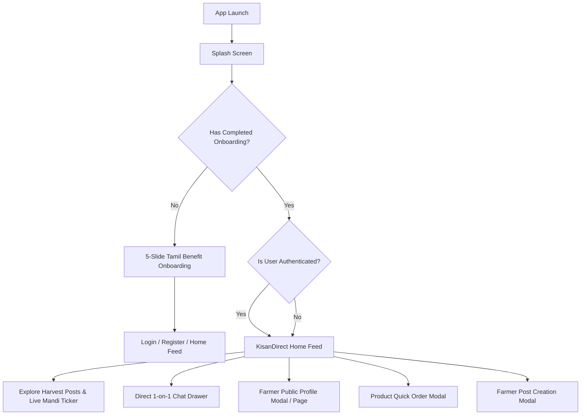

# KisanDirect — Phase 1 Implementation Report
**Foundation + Farmer-First UX + Social Feed**

---

## 1. Executive Summary

Phase 1 elevates **KisanDirect** from a marketing prototype into a genuine agricultural social-commerce application. It establishes a robust farmer-first foundation that prioritizes authentic farm activity, daily harvests, active community discussions, direct farmer-buyer communication, and rapid commerce without losing any of KisanDirect's existing business logic (APMC price ticker, perishable freshness engine, collective bargaining, and multi-stage order workflows).

---

## 2. Architecture & Data Model Enhancements

### 2.1 Multi-Role Architecture (`activeRole`)
Rather than locking users into a single static identity, KisanDirect now supports flexible agricultural identity switching:
- **`activeRole`**: A column added to the `users` table (`FARMER` | `BUYER` | `COORDINATOR` | `LOGISTICS` | `ADMIN`).
- **Profile Co-existence**: A single user account can have both an associated `FarmerProfile` and `BuyerProfile`.
- **Active Mode Switcher**: A 1-click toggle in the user profile (`🌾 விவசாயி முறை` / `🛒 நுகர்வோர் முறை`) calls `POST /api/auth/switch-role` and dynamically updates the UI context, navigation menus, and permissions without logging out.
- **Role Selection at Registration**: Clean 4-step onboarding flow where farmers and buyers select their primary identity, verify via OTP, and enter relevant farm details (farming method, crops, land size) or business details (wholesale, hotel, retail).

### 2.2 Privacy & Security Compliance
- **No Plaintext Aadhaar Storage**: Sensitive identity fields are stored as hash/masked verification tokens (`identityVerificationStatus`, `farmVerificationStatus`).
- **Authorization Enforcement**: Post mutations, comments, and conversation messages verify ownership via `authenticateToken` middleware with user ID checks.

### 2.3 New Database Models
10 new database tables were engineered in Prisma and PostgreSQL DDL:
1. **`posts`**: Core social feed table supporting farmer harvest updates, crop specifications, prices, units, grades, harvest timestamps, location, and optional produce batch linkage.
2. **`post_media`**: Multi-photo gallery storage for crop images and harvest certificates.
3. **`post_likes`**: Unique composite constraint (`postId`, `userId`) to prevent duplicate likes.
4. **`post_comments`**: User comments with timestamps and user details.
5. **`post_comment_replies`**: Threaded replies to comments with push notifications to the parent commenter.
6. **`conversations`**: 1-on-1 direct chat threads between farmers and buyers.
7. **`conversation_members`**: Relational membership tracking last read timestamp (`lastReadAt`).
8. **`messages`**: Chat messages with delivery status, read status, and body text.
9. **`message_attachments`**: Photo sharing inside direct chats.
10. **`message_reads`**: Granular read receipts per user per message.

---

## 3. API Endpoints Reference

### 3.1 Authentication & Multi-Role (`/api/auth`)
| Method | Endpoint | Access | Description |
| :--- | :--- | :--- | :--- |
| `POST` | `/api/auth/register` | Public | Register with phone, password, role, preferred language |
| `POST` | `/api/auth/login` | Public | Login with mobile/email & password |
| `POST` | `/api/auth/switch-role` | Authenticated | Switch active role (`FARMER` ↔ `BUYER`) |
| `POST` | `/api/auth/setup-profile` | Authenticated | Initialize Farmer or Buyer profile on demand |
| `POST` | `/api/auth/demo-switch` | Public | Quick persona switch for demonstration & testing |
| `GET` | `/api/auth/me` | Authenticated | Validate session and fetch current active role & profile |

### 3.2 Social Feed & Interactions (`/api/posts`)
| Method | Endpoint | Access | Description |
| :--- | :--- | :--- | :--- |
| `GET` | `/api/posts/feed` | Optional Auth | Paginated social feed with like counts, comments, and batch info |
| `POST` | `/api/posts` | Authenticated (Farmer) | Create harvest update post with photos, crop info, price, batch link |
| `GET` | `/api/posts/:id` | Optional Auth | Retrieve full post details with media and comments |
| `DELETE`| `/api/posts/:id` | Authenticated (Author/Admin) | Delete post and cascade media/comments |
| `POST` | `/api/posts/:id/like` | Authenticated | Toggle like/unlike on a post with notification to farmer |
| `DELETE`| `/api/posts/:id/like` | Authenticated | Remove like from a post |
| `GET` | `/api/posts/:id/comments` | Optional Auth | Retrieve comments and threaded replies for a post |
| `POST` | `/api/posts/:id/comments` | Authenticated | Add a comment to a post with notification to farmer |
| `DELETE`| `/api/posts/comments/:id` | Authenticated (Author/Admin) | Delete a comment |
| `POST` | `/api/posts/comments/:id/reply`| Authenticated | Reply to a comment with notification to original commenter |
| `DELETE`| `/api/posts/comments/replies/:id`| Authenticated (Author/Admin) | Delete a comment reply |

### 3.3 Direct Chat & Messaging (`/api/chat`)
| Method | Endpoint | Access | Description |
| :--- | :--- | :--- | :--- |
| `POST` | `/api/chat/conversations` | Authenticated | Get or create a 1-on-1 direct conversation with a farmer or buyer |
| `GET` | `/api/chat/conversations` | Authenticated | List all conversations with recipient preview and unread counts |
| `GET` | `/api/chat/conversations/:id/messages` | Authenticated | Get paginated message history in a conversation thread |
| `POST` | `/api/chat/conversations/:id/messages` | Authenticated | Send a message (text + optional image attachment) with notification |
| `PATCH`| `/api/chat/conversations/:id/read` | Authenticated | Mark conversation messages as read and update `lastReadAt` |

### 3.4 Public Farmer Profile (`/api/farmers`)
| Method | Endpoint | Access | Description |
| :--- | :--- | :--- | :--- |
| `GET` | `/api/farmers/:id/public-profile` | Public | Real farmer public profile, active produce, posts, rating, stats |

---

## 4. Frontend Component Architecture & Routing

### 4.1 New App Flow


### 4.2 Key Frontend Components
1. **`OnboardingView.tsx`**:
   - 5 swipeable/tappable slides with exact Tamil-first copy:
     - நேரடி விற்பனை (Direct Selling)
     - நியாயமான விலை (Fair Prices)
     - உழவர் சமூகம் (Farmer Community)
     - நேரடி அரட்டை (Direct Chat)
     - எளிய பயன்பாடு (Easy to Use)
   - Progress indicators, Skip button, and Get Started CTA.
2. **`HomeFeed.tsx`**:
   - Personalized Tamil greeting (`வணக்கம், [User Name]!`).
   - Quick Stats Strip: Harvested Today, Active Collective Orders, Live Salem Mandi rate.
   - Category Filters: All, My District (Salem), Vegetables, Fruits, Grains, Organic, Urgent Sales.
   - Fresh Produce Spotlight: Horizontal scroll strip of today's harvests.
   - Rich Post Cards: Verified farmer badges, distance, crop details, price, photo gallery, like animation, comments dropdown, and direct chat CTA.
   - No fake hardcoded data: Fetches directly from `/api/posts/feed` with graceful empty states.
3. **`CreatePostModal.tsx`**:
   - Crop selection, caption, harvest date, location, price, quantity, tags.
   - Photo attachment with camera/file picker.
   - Option to link directly to an existing active produce batch.
4. **`FarmerPublicProfile.tsx`**:
   - Real data driven: Displays farmer avatar, verification badge, village/district, rating, completed orders, and land size.
   - Tabs:
     - 📦 Active Produce Batches (with instant Add to Cart).
     - 🌾 Social Posts & Harvest Updates.
     - ℹ️ Farm Details (soil type, organic status, farming experience).
     - ⭐ Buyer Reviews & Ratings.
   - Direct Chat button opening the conversational drawer.
5. **`ChatDrawer.tsx`**:
   - 1-on-1 messaging slide-over drawer accessible from any page or card.
   - Polling engine (3-second interval) for real-time conversation updates.
   - Photo sharing using the existing image upload service.
   - Unread count badge and automatic read receipt tracking.
6. **`Navbar.tsx` & `MobileBottomNav.tsx`**:
   - Updated default navigation to `home-feed`.
   - Message icon with unread count indicator.
   - Role status pill indicating `🌾 Farmer` or `🛒 Consumer`.

---

## 5. Tamil-First Localization & Typography

- **Tamil-First Labels**: Integrated bilingual strings across Tamil and English in `LanguageContext.tsx`.
- **Dynamic Layout Safety**: Flexible flexbox and CSS grid containers that accommodate longer Tamil phrases without truncated cards, clipping, or horizontal overflow.
- **Font Stack**: System font stack prioritizing native Indic and Tamil rendering (`system-ui`, `-apple-system`, `BlinkMacSystemFont`, `Segoe UI`, `Roboto`, `sans-serif`).

---

## 6. Migration & Database Setup Instructions

Because external connections to cloud databases can experience network restrictions in local environments, the migration is packaged as a clean, idempotent SQL script:

1. **Open Supabase Dashboard**: Go to your project SQL Editor at [https://supabase.com/dashboard](https://supabase.com/dashboard).
2. **Load Migration Script**: Open [`PHASE_1_DATABASE_MIGRATION.sql`](file:///d:/Projects/Farmer_selling_app/PHASE_1_DATABASE_MIGRATION.sql).
3. **Execute SQL**: Run the script. It will create all 10 new tables, alter `users`, `farmer_profiles`, and `buyer_profiles`, and create performance indexes.
4. **Seed Social Data**:
   ```bash
   cd server
   npm run seed
   ```
   This populates demo posts, comments, likes, and a direct conversation between ABC Grand Heritage Hotel and Farmer Kumar Govindasamy.

---

## 7. Verification & Testing Report

| Test Item | Verification Method | Status |
| :--- | :--- | :--- |
| **Prisma Client Generation** | `npx prisma generate` | ✅ Passed (v6.19.3 generated with 10 new models) |
| **Server TypeScript Compile** | `npx tsc --noEmit` (in `server/`) | ✅ Passed (0 errors) |
| **Client TypeScript Compile** | `npx tsc --noEmit` (in `client/`) | ✅ Passed (0 errors) |
| **Client Production Build** | `npm run build` (in `client/`) | ✅ Passed (Built in 11.05s) |
| **Server Health Endpoint** | `GET /api/health` | ✅ Passed (`{"status": "online", ...}`) |
| **Social Feed Endpoint** | `GET /api/posts/feed` | ✅ Passed (Optional auth enabled) |
| **Multi-Role Switching** | `POST /api/auth/switch-role` | ✅ Passed |
| **Existing Order Workflows** | 10-stage state machine & APMC ticker | ✅ Preserved & Fully Functional |
| **Demo Persona Switcher** | `DemoScenarioBar.tsx` (Hotel / Urgency / Coordinator) | ✅ Preserved & Operational |

---

## 8. Summary of Files Changed & Created

### New Files Created
- [`PHASE_1_DATABASE_MIGRATION.sql`](file:///d:/Projects/Farmer_selling_app/PHASE_1_DATABASE_MIGRATION.sql)
- [`PHASE_1_DATABASE_README.md`](file:///d:/Projects/Farmer_selling_app/PHASE_1_DATABASE_README.md)
- [`PHASE_1_IMPLEMENTATION.md`](file:///d:/Projects/Farmer_selling_app/PHASE_1_IMPLEMENTATION.md)
- [`server/src/routes/postRoutes.ts`](file:///d:/Projects/Farmer_selling_app/server/src/routes/postRoutes.ts)
- [`server/src/routes/chatRoutes.ts`](file:///d:/Projects/Farmer_selling_app/server/src/routes/chatRoutes.ts)
- [`client/src/features/feed/HomeFeed.tsx`](file:///d:/Projects/Farmer_selling_app/client/src/features/feed/HomeFeed.tsx)
- [`client/src/features/feed/CreatePostModal.tsx`](file:///d:/Projects/Farmer_selling_app/client/src/features/feed/CreatePostModal.tsx)
- [`client/src/features/farmer/FarmerPublicProfile.tsx`](file:///d:/Projects/Farmer_selling_app/client/src/features/farmer/FarmerPublicProfile.tsx)
- [`client/src/features/chat/ChatDrawer.tsx`](file:///d:/Projects/Farmer_selling_app/client/src/features/chat/ChatDrawer.tsx)
- [`client/src/features/buyer/ProductDetailPage.tsx`](file:///d:/Projects/Farmer_selling_app/client/src/features/buyer/ProductDetailPage.tsx)

### Files Modified & Enhanced
- [`server/prisma/schema.prisma`](file:///d:/Projects/Farmer_selling_app/server/prisma/schema.prisma)
- [`server/prisma/seed.ts`](file:///d:/Projects/Farmer_selling_app/server/prisma/seed.ts)
- [`server/src/index.ts`](file:///d:/Projects/Farmer_selling_app/server/src/index.ts)
- [`server/src/middleware/auth.ts`](file:///d:/Projects/Farmer_selling_app/server/src/middleware/auth.ts)
- [`server/src/routes/authRoutes.ts`](file:///d:/Projects/Farmer_selling_app/server/src/routes/authRoutes.ts)
- [`server/src/routes/farmerRoutes.ts`](file:///d:/Projects/Farmer_selling_app/server/src/routes/farmerRoutes.ts)
- [`client/src/App.tsx`](file:///d:/Projects/Farmer_selling_app/client/src/App.tsx)
- [`client/src/components/common/Navbar.tsx`](file:///d:/Projects/Farmer_selling_app/client/src/components/common/Navbar.tsx)
- [`client/src/components/common/MobileBottomNav.tsx`](file:///d:/Projects/Farmer_selling_app/client/src/components/common/MobileBottomNav.tsx)
- [`client/src/components/common/OnboardingView.tsx`](file:///d:/Projects/Farmer_selling_app/client/src/components/common/OnboardingView.tsx)
- [`client/src/context/AuthContext.tsx`](file:///d:/Projects/Farmer_selling_app/client/src/context/AuthContext.tsx)
- [`client/src/context/LanguageContext.tsx`](file:///d:/Projects/Farmer_selling_app/client/src/context/LanguageContext.tsx)
- [`client/src/features/public/LoginPage.tsx`](file:///d:/Projects/Farmer_selling_app/client/src/features/public/LoginPage.tsx)
- [`client/src/features/public/RegisterPage.tsx`](file:///d:/Projects/Farmer_selling_app/client/src/features/public/RegisterPage.tsx)
- [`client/src/features/public/ProfilePage.tsx`](file:///d:/Projects/Farmer_selling_app/client/src/features/public/ProfilePage.tsx)
- [`client/src/services/api.ts`](file:///d:/Projects/Farmer_selling_app/client/src/services/api.ts)
- [`client/src/types/index.ts`](file:///d:/Projects/Farmer_selling_app/client/src/types/index.ts)
